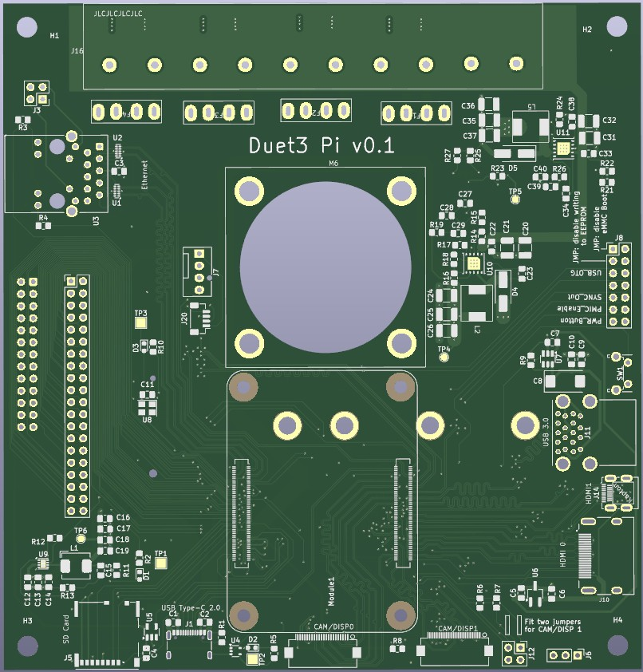
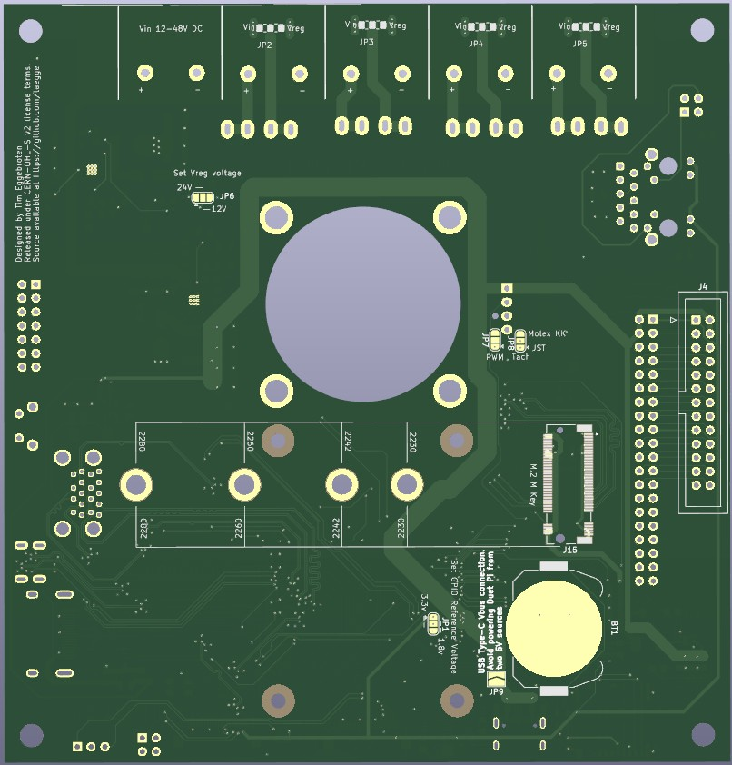
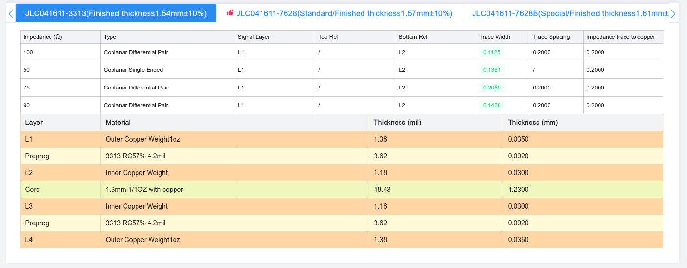

# Board Layout

# PCB Fabrication

For impedance control, pcb was designed for the specific board stackup from jlcpcb: JLC041611-3313

4 layers. 1oz copper inner and outer. 1.6mm thick

provided by https://jlcpcb.com/pcb-impedance-calculator